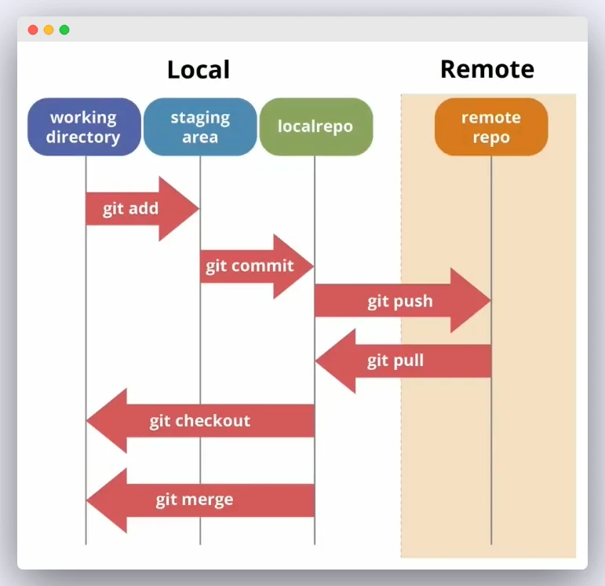

## ¿Qué es Git y para qué sirve?

Git es un sistema de control de versiones de nuestro código.

Hablamos de tener nuestro código siempre a salvo y protegido. Nunca se sabe cuando puede fallarnos el equipo donde guardamos nuestro programa y tirar por la borda todo el trabajo que llevásemos realizado.

Para ello no hay nada mejor que utilizar la *nube*. La nube además nos permite acceder a los ficheros desde cualquier lugar y además nos permite llevar un control de versiones que siempre será importante mantener. Nunca se sabe cuándo necesitaremos volver atrás para retomar el código antiguo. Además estas herramientas nos proporcionan una gran ayuda a la hora de poder trabajar en equipo donde varios desarrolladores *tocan* el código al mismo tiempo.

> Git es un software de control de versiones de nuestro código

**Git** nos permite hacer todo esto, no voy a decir sin esfuerzo pero seguro que nunca nos arrepentiremos de haberlo implementado en nuestra rutina de trabajo.

Yo utilizo **GitHub**, me acostumbré a la herramienta de escritorio que tiene para Windows y es el software que utilizo aunque ahora lo vengo utilizando desde la consola a base de comandos (más rápido). No hay que asustarse con esto ya que tampoco son tantos comandos y con una pequeña *chuleta* pronto te manejas y ves lo útil que puede resultar.

Para empezar tenemos que tener una cuenta en *GitHub* que es gratuita y permite que subas todo tu código y lo mantengas organizado. Además de instalar *Git* en nuestro ordenador.

Mi flujo de trabajo es el siguiente:

* Primero creo un repositorio en *GitHub*, poniendo el mismo nombre que luego utilizaré en la estructura de carpetas de mi ordenador.
* Luego desde el  botón *Code* copiamos la *url* del repositorio recién creado.
* Ahora vamos a nuestro ordenador y creamos la carpeta que contendrá nuestro proyecto.
* Y dentro hacemos > botón derecho *Git Bash Here* que nos abrirá una ventana de comandos (consola).

## Arrancar nuestro repositorio

`git clone [url]`

Con este primer comando conseguimos clonar nuestro repositorio de GitHub, aún vacío, en nuestro equipo. Digamos que hemos inicializado el repositorio.

## Añadir archivos a nuestro proyecto

Imaginad que creamos algún archivo (por ejemplo un script de R), pues con el siguiente código añadimos ese archivo a nuestro *Staging Area* que es un área virtual que almacena los cambios que puedan tener los ficheros con los que estamos trabajando.

`git add archivo.ext`

## Empaquetar los cambios

Según vayamos trabajando en local y realizando cambios en nuestro código nos convendrá subirlo al Repositorio remoto en GitHub, para ello hacemos:

`git commit -m "Documentar cambios realizados"`

Con esto conseguimos subir a Local repo el conjunto de cambios empaquetados y documentado para posteriormente enviarlo a GitHub.

## Subida al repositorio remoto

`git push`

Esto subirá a GitHub todos nuestros ficheros modificados. 

La primera vez que hacemos el *push* nos pedirá un usuario y contraseña de GitHub.

Únicamente con estos pasos nos aseguramos tener siempre a salvo nuestros ficheros de código.

