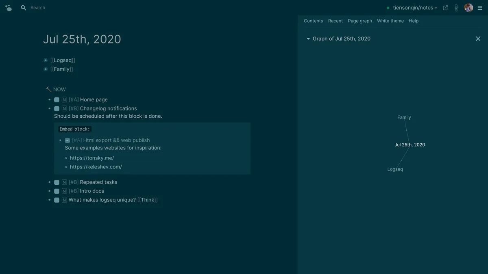

# Introducción
  
  Logseq es una herramienta de toma de notas y organización personal que se basa en Markdown y enlaces bidireccionales. Logseq permite crear notas interconectadas con enlaces bidireccionales para ayudarte a navegar y explorar tus pensamientos de una manera más intuitiva. Este manual está diseñado para darte una introducción a las características y funcionalidades básicas de Logseq.

# Instalación y configuración
  
  Logseq es una aplicación de escritorio que funciona en Windows, macOS y Linux. Puedes descargar Logseq desde su página web oficial en [https://logseq.com/](https://logseq.com/) y seguir las instrucciones de instalación. Una vez instalado, puedes abrir la aplicación y comenzar a crear notas.  

# Creación de notas
Para crear una nueva nota en Logseq, haz clic en el botón "Nueva nota" o presiona la tecla "N". También puedes crear una nueva nota desde cualquier otra nota haciendo clic en el botón "+", que aparece cuando pasas el cursor sobre el encabezado de una nota. Una vez que hayas creado la nueva nota, se abrirá automáticamente para que puedas comenzar a escribir.

> Hoy en día, todo el mundo es un buscador de conocimiento. Logseq es la herramienta para flujos de trabajo que necesitan de una gran cantidad de información

## Dar formato a tus notas con Markdown
  
  Las notas en Logseq están escritas en Markdown, lo que significa que puedes agregar títulos, viñetas, enlaces y otros elementos de Markdown para dar formato a tus notas. Aquí hay algunos ejemplos de cómo puedes dar formato a tus notas con Markdown:

### Títulos
  
  Para agregar un título a tu nota, simplemente comienza la línea con uno o más símbolos "#" seguidos de un espacio y el texto del título. Por ejemplo:  
  
  ```
  # Este es un título de nivel 1
  ## Este es un título de nivel 2
  ### Este es un título de nivel 3
  ```

### Viñetas
  
  Para agregar viñetas a tu nota, puedes utilizar los símbolos "-" o "*" seguidos de un espacio y el texto de la viñeta. Por ejemplo:  
  
  ```
  - Esta es una viñeta
  - Esta es otra viñeta
  ```

### Enlaces
  
  Para agregar un enlace a tu nota, utiliza la sintaxis `[texto del enlace](URL del enlace)`. Por ejemplo:  
  
  ```
  Este es un [enlace a la página de Logseq](https://logseq.com/)
  ```



## Agregar imágenes
  
  También puedes agregar imágenes a tus notas utilizando Markdown. Para hacerlo, debes cargar la imagen a un servidor de imágenes en línea y obtener la URL de la imagen. Luego, utiliza la sintaxis `` para agregar la imagen a tu nota. Por ejemplo:  
  
  ```
  
  ```

## Enlazar a otras notas
  
  Como mencioné en el apartado de "Enlaces bidireccionales", Logseq te permite crear enlaces bidireccionales entre notas para navegar fácilmente entre ellas. Para crear un enlace a otra nota en Logseq, simplemente escribe el nombre de la nota entre corchetes dobles `[[nombre de la nota]]`. Por ejemplo:  
  
  ```
  Esto es una referencia a otra nota: [[Mi otra nota]]
  ```
  
  Cuando guardes la nota, Logseq automáticamente creará un enlace a la nota "Mi otra nota". Si haces clic en el enlace, se abrirá la nota correspondiente.  

# Enlaces bidireccionales
  
  Una de las características más potentes de Logseq es la capacidad de crear enlaces bidireccionales entre notas. Esto significa que cuando creas un enlace a una nota desde otra nota, Logseq automáticamente crea un enlace de vuelta desde la nota original a la nota nueva. Esto facilita la navegación y la creación de conexiones entre tus notas.  
  
  Por ejemplo, si tienes una nota sobre "Proyectos" y otra nota sobre "Tareas", puedes crear un enlace bidireccional entre ellas para mostrar que "Proyectos" contiene tareas y que las tareas pertenecen a proyectos.  

## Cómo crear enlaces bidireccionales
  
  Para crear un enlace bidireccional entre dos notas en Logseq, sigue estos pasos:  
- Abre la nota desde la que deseas crear un enlace a otra nota.
- Escribe el nombre de la nota a la que deseas enlazar entre corchetes dobles `[[nombre de la nota]]`.
- Guarda la nota.
  
  Logseq detectará automáticamente que has creado un enlace a otra nota y creará un enlace bidireccional desde esa nota de vuelta a la nota original. Si haces clic en cualquiera de los enlaces, se abrirá la nota correspondiente.  

## Cómo utilizar los enlaces bidireccionales
  
  Los enlaces bidireccionales pueden ayudarte a crear una estructura de conocimiento más cohesiva y conectada. Puedes utilizarlos para:  
- Crear una jerarquía de notas relacionadas, por ejemplo, notas sobre un tema más amplio y notas más específicas que se relacionan con ese tema.
- Visualizar las relaciones entre diferentes temas y conceptos, lo que puede ayudarte a ver patrones y conexiones que de otra manera podrían pasar desapercibidos.
- Facilitar la navegación entre diferentes notas, lo que puede ahorrarte tiempo y hacer que sea más fácil encontrar la información que necesitas.
- Los enlaces bidireccionales son una de las características más útiles y potentes de Logseq. Utilizarlos puede ayudarte a crear una estructura de conocimiento más conectada y cohesiva, lo que puede mejorar tu capacidad para aprender y recordar información.

# Búsquedas y consultas
  
  Logseq también ofrece una función de búsqueda y consulta muy potente que te permite encontrar notas en función de palabras clave, etiquetas y otros criterios. Para buscar notas, haz clic en la barra de búsqueda en la parte superior de la pantalla o presiona la tecla "/" para abrir la barra de búsqueda. Puedes escribir palabras clave o etiquetas y Logseq mostrará todas las notas relacionadas.  
  
  También puedes utilizar consultas avanzadas en Logseq para realizar búsquedas más específicas. Por ejemplo, puedes buscar notas que contengan una palabra clave específica y una etiqueta específica utilizando la sintaxis "palabra clave #etiqueta".  

# Exportación y sincronización
  
  Logseq también te permite exportar tus notas a diferentes formatos, como Markdown, HTML y PDF. Puedes acceder a la función de exportación haciendo clic en "Archivo" y luego en "Exportar". También puedes sincronizar tus notas con otros servicios de almacenamiento en la nube, como Google Drive o Dropbox, para asegurarte de que siempre tengas una copia de seguridad de tus notas.  

# Conclusión
  
  Logseq es una herramienta potente y versátil que puede ayudarte a organizar y explorar tus pensamientos y notas de una manera intuitiva y efectiva. Con este manual básico, deberías tener suficiente información para comenzar a utilizar Logseq y aprovechar al máximo sus características y funcionalidades.